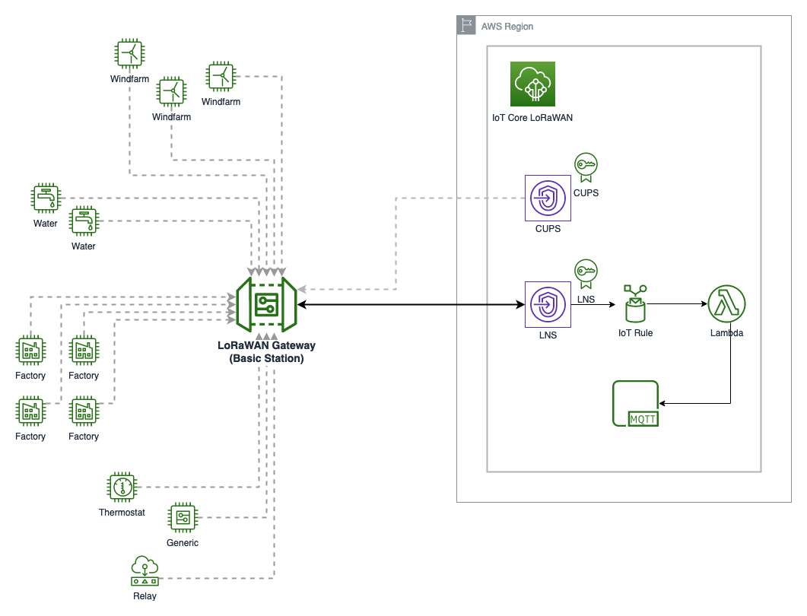
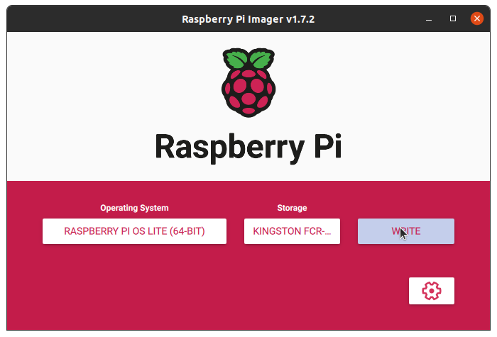
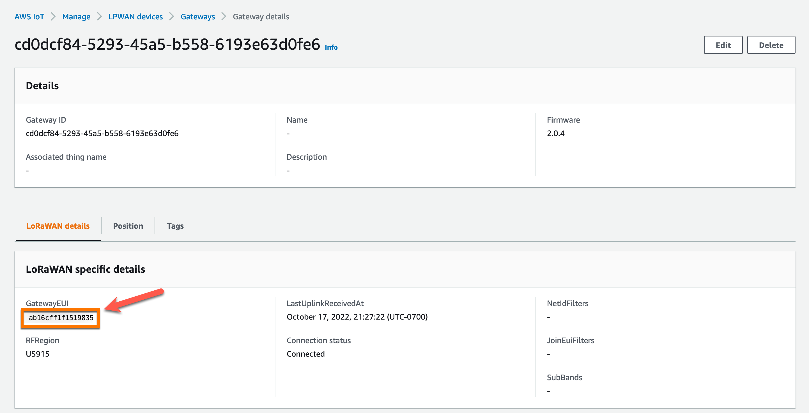
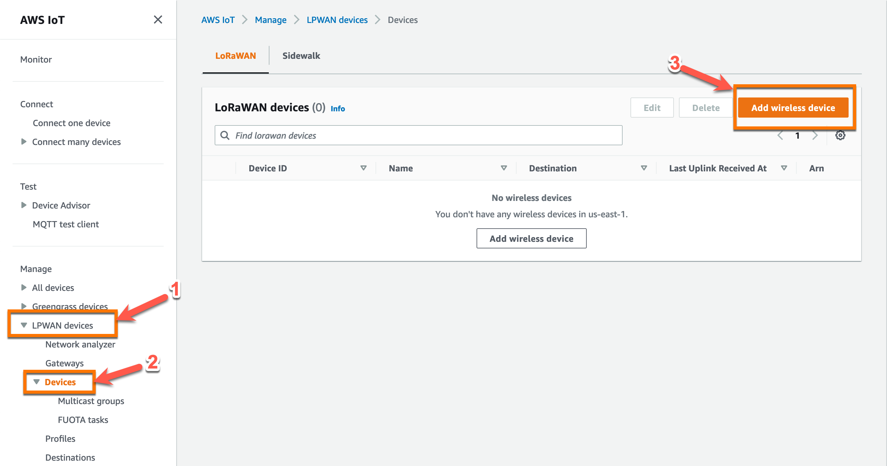
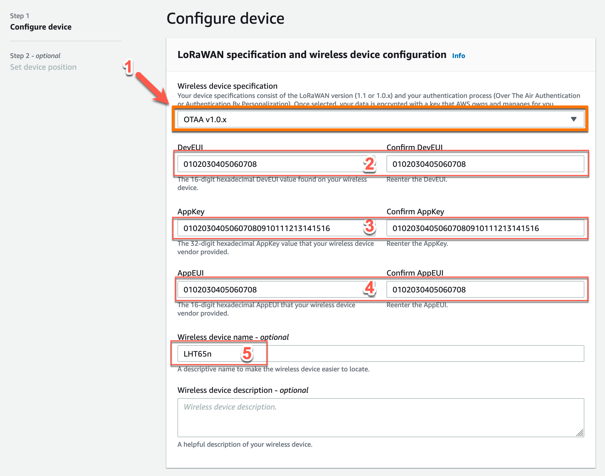

# **Setting up AWS IoT LoRaWAN Gateway for PoC**
---

AWS IoT Core for LoRaWAN helps to connect and manage wireless LoRaWAN (low-power long-range Wide Area Network) devices and replaces the need to develop and operate a LoRaWAN Network Server (LNS). Learn more about AWS IoT Core for LoRaWAN using this [link](https://docs.aws.amazon.com/iot/latest/developerguide/connect-iot-lorawan.html)

This document will walk through on how to create an AWS IoT LoRaWAN gateway for demos and PoC. 




---

<details>
<summary>Table of Contents</summary>

- [**Setting up AWS IoT LoRaWAN Gateway for PoC**](#setting-up-aws-iot-lorawan-gateway-for-poc)
  - [Requirements](#requirements)
    - [**Hardware**](#hardware)
    - [**Software**](#software)
  - [Setup](#setup)
    - [**Install OS**](#install-os)
    - [**Install Software**](#install-software)
    - [**Setup LoRaWAN Gateway**](#setup-lorawan-gateway)
    - [**Add LoRa Devices**](#add-lora-devices)
  - [References](#references)
</details>

---

## Requirements

### **Hardware**

||||
|---|---|---|
|1.|Raspberry Pi 4B| 4GB or 8GB|
|2.|Micro SD Card|32GB or 64GB|
|3.|Micro SD Card reader|1| 
|4.|USB-C power supply|5V 3Amp (15W recommended)|
|5.|LoRaWAN Concentrator|eg. RAK2287(SPI), WM1302(SPI)|
|6.|LoRa Device|eg. Dragino LHT65N, SenseCAP S2102 |

> ***Demo Setup:*** RAK2287 SPI module is installed with a Pi-Hat on a Raspberry Pi 4B.

<br>

<br>

### **Software**

||||
|-|-|-|
|1.|AWS Account|[Isengard](https://isengard.amazon.com)|
|2.|AWS Command Line Interface (AWS CLI)|[AWS CLI](https://docs.aws.amazon.com/cli/latest/userguide/getting-started-install.html)|
|3.|Raspberry Pi Imager|[Raspberry Pi Downloads](https://www.raspberrypi.com/software/)|
|4.|Raspberry Pi OS Lite|[Bullseye 64bit OS](https://downloads.raspberrypi.org/raspios_lite_arm64/images/raspios_lite_arm64-2022-09-26/2022-09-22-raspios-bullseye-arm64-lite.img.xz)|

---

## Setup

### **Install OS**

This part of the setup covers the steps to install Rasberry Pi Bullseye 64bit Lite headless OS. Keyboard and mouse is not

1. Download [Bullseye 64bit Lite](https://downloads.raspberrypi.org/raspios_lite_arm64/images/raspios_lite_arm64-2022-09-26/2022-09-22-raspios-bullseye-arm64-lite.img.xz) OS image
2. Connect the MicroSD card reader to your machine
3. Insert the 32GB (or 64GB) micro SD card in the card reader
4. Launch Raspberry Pi Imager on your machine
5. Click on **Choose OS** button, then scroll to the bottom of the menu and click on **Use custom** 
6. Select ***raspios_lite_arm64-2022-09-26/2022-09-22-raspios-bullseye-arm64-lite.img.xz*** from the downloaded folder
7. Click on **CHOOSE STORAGE** button to select the SD card
8. Click on ***Advanced options*** (gear icon) button
    - Check the ***Set hostname*** box and set value as *gateway01*
    - Check the ***Enable SSH*** box and select the *Use password authentication* or *Allow public-key authentication only* and password of ssh public-key accordingly
    - Check the **Set username and password** box and add *Username* and *Password*
    - Check the **Configure wireless LAN** and set the *SSID* and *Password* of wireless network to connect
    - Chose the Wireless Lan country from the drop down menu
    - Check the **Set locale settings** and set the *Time zone* and *Keyboard layout* for the Rasberry Pi OS
    - (Optional step) Check the **Play sound when finished** box
    - (Optional step) Check the **Eject media when finished** box
    - Click on **Save** button to return to the main screen
9.  Click on **Write** button to start installing the OS
10. Remove the micro SD card when OS installation completes *(installation may take upto 15mins)*
11. Insert the micro SD card in Raspberry Pi SD card slot and power on



<br>

### **Install Software**

1. SSH to raspberry pi
   ```bash
   ssh pi@gateway01.local
   ```
2. Upgrade and install additional packages
    ```bash
    alias 'apt=DEBIAN_FRONTEND=noninteractive apt'
    sudo apt update -y
    sudo apt upgrade -y
    sudo apt install -y build-essential
    sudo apt install -y python3 python3-pip 
    sudo apt install -y cmake libudev-dev
    sudo apt install -y libusb-1.0-0-dev libffi-dev
    sudo apt install -y libssl-dev git
    sudo apt install -y minicom socat
    sudo apt install -y libqmi-utils udhcpc mtr gnutls-bin
    sudo apt install -y p7zip-full i2c-tools gpsd
    sudo apt install -y mlocate vim jq
    sudo apt install -y m4 pkg-config
    sudo apt install -y libcurl4-openssl-dev
    ```
3. Disable power-savings mode and Bluetooth
   ```bash
    sudo sed -i '/exit\ 0/i \
    iw wlan0 set power_save off \
    iw dev wlan0 set power_save off \
    export MTP_NO_PROBE="1" \
    ' /etc/rc.local

    sudo systemctl stop bluetooth.service bluetooth.target
    sudo systemctl disable bluetooth.service
    ```
4. Install additional Python packages
    ```bash
    pip install --upgrade pip
    pip install --upgrade setuptools
    export CFLAGS=-fcommon
    pip install RPi.GPIO
    ```
5. Enable SPI, I2C and Serial using raspi-config tool
    ```bash
    sudo raspi-config
    ```
    - -> Select **Interface Options** 
        - select -> **SPI** -> **enable** 
        - Enter **Ok**
    - -> Select **Interface Options** 
        - select -> **I2C** -> **enable** 
            - Enter **Ok**
    - -> Select **Interface Options** 
        - select -> **Serial Port**  
            - -> *Would you like a login shell to be accessible over serial?* -> Select **No**
            - -> *Would you like the serial port hardware to be enabled?* -> Select **Yes** 
        - Enter **Ok**
    - Enter **Finish**
6. Reboot Raspberry pi 
    ```bash
    sudo reboot
    ```

### **Setup LoRaWAN Gateway**

1. Install sx1302 util tool and copy the concentrator EUI after executing *`chip_id`* command
    ```bash
    git clone https://github.com/Lora-net/sx1302_hal.git
    cd sx1302_hal/
    make clean all
    cd tools/
    ../util_chip_id/chip_id
    ```
    > 
    > CoreCell reset through GPIO17...  
    > SX1261 reset through GPIO17...  
    > CoreCell power enable through GPIO18...  
    > CoreCell ADC reset through GPIO13...  
    > Opening SPI communication interface  
    > Note: chip version is 0x10 (v1.0)  
    > INFO: using legacy timestamp  
    > ARB: dual demodulation disabled for all SF  
    > INFO: found temperature sensor on port 0x39  
    >   
    > INFO: concentrator **`EUI: 0xab16cff1f1519835`**  
    >   
    > Closing SPI communication interface  
    > CoreCell reset through GPIO17...  
    > SX1261 reset through GPIO17...  
    > CoreCell power enable through GPIO18...  
    > CoreCell ADC reset through GPIO13...  
2. Install LoRa Basic Station 
    ```bash
    git clone https://github.com/lorabasics/basicstation.git
    cd basicstation
    make platform=corecell variant=std
    ```
3. Create LoRaWAN Gateway in AWS IoT Core
    ```bash
    GWName=awsGateway01
    GWEUI=ab16cff1f1519835
    mkdir ${GWName}
    cd ${GWName}
    ENDPOINT=`aws iotwireless get-service-endpoint|jq -r '.ServiceEndpoint'`
    echo -n $ENDPOINT>cups.uri
    aws iotwireless get-service-endpoint| jq -r '.ServerTrust'>cups.trust
    export cid=`aws iot create-keys-and-certificate \
    --certificate-pem-outfile "cups.crt" \
    --public-key-outfile "cups.pub" \
    --private-key-outfile "cups.key" \
    --set-as-active | jq -r '.certificateId'`

    export gid=`aws iotwireless create-wireless-gateway \
        --lorawan GatewayEui=${GWEUI},RfRegion="US915" \
        --name ${GWName} \
        --description ${GWName}| jq -r '.Id'`

    aws iotwireless associate-wireless-gateway-with-certificate \
        --id ${gid} \
        --iot-certificate-id ${cid}
    ```
    > 
    > {  
    >    "IotCertificateId": "d825bec27e9c6cff611a15ab7f8a259b6fbdd5656a8f3fe1f4ca8f78d8540b10"  
    > }  
4. Start basicstation
    ```bash
    ../build-corecell-std/bin/station
    ```
    <details>
    <summary>Starting basicstation command log</summary>
  
    > 2022-10-18 04:27:19.594 [SYS:INFO] Logging     : stderr (maxsize=10000000, rotate=3)  
    > 2022-10-18 04:27:19.594 [SYS:INFO] Station Ver : 2.0.6(corecell/std) 2022-10-15 09:32:35  
    > 2022-10-18 04:27:19.594 [SYS:INFO] Package Ver : 2.0.4  
    > 2022-10-18 04:27:19.594 [SYS:INFO] mbedTLS Ver : 2.28.0  
    > 2022-10-18 04:27:19.594 [SYS:INFO] proto EUI   : 0:e45f:15a:e55c	(/sys/class/net/eth0/address)  
    > 2022-10-18 04:27:19.594 [SYS:INFO] prefix EUI  : ::1	(builtin)  
    > 2022-10-18 04:27:19.595 [SYS:INFO] Station EUI : ab16:cff1:f151:9835   
    > 2022-10-18 04:27:19.595 [SYS:INFO] Station home: ./	(builtin)  
    > 2022-10-18 04:27:19.595 [SYS:INFO] Station temp: /var/tmp/	(builtin)  
    > 2022-10-18 04:27:19.799 [TCE:INFO] Starting TC engine  
    > 2022-10-18 04:27:19.804 [TCE:ERRO] No TC URI configured  
    > 2022-10-18 04:27:19.804 [CUP:INFO] Starting a CUPS session in 0 seconds.  
    > 2022-10-18 04:27:19.804 [TCE:INFO] Router rejected or retry limit reached. Invoking CUPS.  
    > 2022-10-18 04:27:19.804 [TCE:INFO] Terminating TC engine  
    > 2022-10-18 04:27:19.804 [CUP:INFO] Starting a CUPS session now.  
    > 2022-10-18 04:27:19.804 [CUP:INFO] Connecting to CUPS ... https://ABCDEFGHIJKLMN.cups.lorawan.us-west-2.amazonaws.com:443 (try #1)  
    > 2022-10-18 04:27:19.824 [AIO:INFO] ./cups.trust:  
    > cert. version     : 3  
    > serial number     : A7:0E:4A:4C:34:82:B7:7F  
    > issuer name       : C=US, O=Starfield Technologies, Inc., OU=Starfield Class 2 Certification Authority  
    > subject name      : C=US, ST=Arizona, L=Scottsdale, O=Starfield Technologies, Inc., CN=Starfield Services Root Certificate Authority - G2  
    > issued  on        : 2009-09-02 00:00:00  
    > expires on        : 2034-06-28 17:39:16  
    > signed using      : RSA with SHA-256  
    > RSA key size      : 2048 bits  
    > basic c2022-10-18 04:27:19.827 [AIO:INFO] ./cups.crt:  
    > cert. version     : 3  
    > serial number     : B7:30:AC:E9:83:42:86:E4:CA:BD:44:6D:9F:DE:5A:3E:2F:70:1B:70  
    > issuer name       : OU=Amazon Web Services O=Amazon.com Inc. L=Seattle ST=Washington C=US  
    > subject name      : CN=AWS IoT Certificate  
    > issued  on        : 2022-10-18 04:24:05  
    > expires on        : 2049-12-31 23:59:59  
    > signed using      : RSA with SHA-256  
    > RSA key size      : 2048 bits  
    > basic constraints : CA=false  
    > key usage         : Digital Signature  
    > 2022-10-18 04:27:19.933 [CUP:VERB] Retrieving update-info from CUPS https://ABCDEFGHIJKLMN.cups.lorawan.us-west-2.amazonaws.com:443...  
    > 2022-10-18 04:27:19.934 [CUP:DEBU] CUPS Request: {"router":"ab16:cff1:f151:9835","cupsUri":"https://ABCDEFGHIJKLMN.cups.lorawan.us-west-2.amazonaws.com:443","tcUri":  null,> "cupsCredCrc":1514754260,"tcCredCrc":2077607535,"station":"2.0.6(corecell/std) 2022-10-15 09:32:27","model":"corecell","package":"2.0.4","keys":[]}  
    > 2022-10-18 04:27:20.959 [CUP:INFO] [Segment] TC URI: wss://ABCDEFGHIJKLMN.lns.lorawan.us-west-2.amazonaws.com:443  
    > 2022-10-18 04:27:20.959 [CUP:INFO] [Segment] TC Credentials (3198 bytes)  
    > 2022-10-18 04:27:20.959 [SYS:INFO]  credComplete - trust_off=   0, trust_len=1145               30 82 04 75  30 82 03 5d  
    > 2022-10-18 04:27:20.959 [SYS:INFO]  credComplete - cert_off =1145, cert_len = 862  5d f4 03 8c  30 82 03 5a  30 82 02 42  
    > 2022-10-18 04:27:20.959 [SYS:INFO]  credComplete - key_off  =2007, key_len  =1191  41 04 ab 37  30 82 04 a3  02 01 00 02  
    > 2022-10-18 04:27:20.959 [CUP:INFO] [Segment] TC Credentials update completed (3198 bytes)  
    > 2022-10-18 04:27:20.980 [AIO:DEBU] [3] HTTP connection shutdown...  
    > 2022-10-18 04:27:20.980 [CUP:INFO] CUPS provided TC updates (uri) - restarting TC engine  
    > 2022-10-18 04:27:20.980 [CUP:INFO] Interaction with CUPS done - next regular check in 1d  
    > 2022-10-18 04:27:20.980 [TCE:INFO] Starting TC engine  
    > 2022-10-18 04:27:20.980 [AIO:INFO] ./tc.trust:  
    > cert. version     : 3  
    > serial number     : A7:0E:4A:4C:34:82:B7:7F  
    > issuer name       : C=US, O=Starfield Technologies, Inc., OU=Starfield Class 2 Certification Authority  
    > subject name      : C=US, ST=Arizona, L=Scottsdale, O=Starfield Technologies, Inc., CN=Starfield Services Root Certificate Authority - G2  
    > issued  on        : 2009-09-02 00:00:00  
    > expires on        : 2034-06-28 17:39:16  
    > signed using      : RSA with SHA-256  
    > RSA key size      : 2048 bits  
    > basic con2022-10-18 04:27:20.981 [AIO:INFO] ./tc.crt:  
    > cert. version     : 3  
    > serial number     : C9:5B:65:1D:2B:4F:ED:7B:AA:F7:7F:8B:FD:9B:39:D1:57:B9:F2:25  
    > issuer name       : OU=Amazon Web Services O=Amazon.com Inc. L=Seattle ST=Washington C=US  
    > subject name      : CN=AWS IoT Certificate  
    > issued  on        : 2022-10-18 04:25:20  
    > expires on        : 2049-12-31 23:59:59  
    > signed using      : RSA with SHA-256  
    > RSA key size      : 2048 bits  
    > basic constraints : CA=false  
    > key usage         : Digital Signature  
    > 2022-10-18 04:27:20.981 [TCE:INFO] Connecting to INFOS: wss://ABCDEFGHIJKLMN.lns.lorawan.us-west-2.amazonaws.com:443  
    > 2022-10-18 04:27:21.954 [TCE:INFO] Infos: e45f:01ff:fe5a:e55c e45f:01ff:fe5a:e55c wss://ABCDEFGHIJKLMN.lns.lorawan.us-west-2.amazonaws.com:443/gateway/ab16cff1f1519835  
    > 2022-10-18 04:27:21.954 [AIO:DEBU] [3] ws_close reason=1000  
    > 2022-10-18 04:27:21.954 [AIO:DEBU] [3|WS] Server sent close: reason=1006  
    > 2022-10-18 04:27:21.954 [AIO:DEBU] [3] WS connection shutdown...  
    > 2022-10-18 04:27:21.954 [AIO:INFO] ./tc.trust:  
    > cert. version     : 3  
    > serial number     : A7:0E:4A:4C:34:82:B7:7F  
    > issuer name       : C=US, O=Starfield Technologies, Inc., OU=Starfield Class 2 Certification Authority  
    > subject name      : C=US, ST=Arizona, L=Scottsdale, O=Starfield Technologies, Inc., CN=Starfield Services Root Certificate Authority - G2  
    > issued  on        : 2009-09-02 00:00:00  
    > expires on        : 2034-06-28 17:39:16  
    > signed using      : RSA with SHA-256  
    > RSA key size      : 2048 bits  
    > basic con2022-10-18 04:27:21.954 [AIO:INFO] ./tc.crt:  
    > cert. version     : 3  
    > serial number     : C9:5B:65:1D:2B:4F:ED:7B:AA:F7:7F:8B:FD:9B:39:D1:57:B9:F2:25  
    > issuer name       : OU=Amazon Web Services O=Amazon.com Inc. L=Seattle ST=Washington C=US  
    > subject name      : CN=AWS IoT Certificate  
    > issued  on        : 2022-10-18 04:25:20  
    > expires on        : 2049-12-31 23:59:59  
    > signed using      : RSA with SHA-256  
    > RSA key size      : 2048 bits  
    > basic constraints : CA=false  
    > key usage         : Digital Signature  
    > 2022-10-18 04:27:21.954 [TCE:VERB] Connecting to MUXS...  
    > 2022-10-18 04:27:22.757 [TCE:VERB] Connected to MUXS.  
    > 2022-10-18 04:27:22.825 [S2E:WARN] Unknown field in router_config - ignored: protocol (0xFD309030)  
    > 2022-10-18 04:27:22.825 [S2E:WARN] Unknown field in router_config - ignored: regionid (0xE6FFB211)  
    > 2022-10-18 04:27:22.826 [SYS:VERB] rinit.sh: Forked, waiting...  
    > 2022-10-18 04:27:22.826 [SYS:DEBU] execvp argv[0]: </bin/bash>  
    > 2022-10-18 04:27:22.826 [SYS:DEBU]        argv[1]: <rinit.sh>  
    > 2022-10-18 04:27:22.826 [SYS:DEBU]        argv[2]: <rinit.sh>  
    > 2022-10-18 04:27:22.826 [SYS:DEBU]        argv[3]: </dev/spidev0.0>  
    > CoreCell reset through GPIO17...  
    > CoreCell power enable through GPIO18...  
    > 2022-10-18 04:27:23.550 [SYS:INFO] Process rinit.sh (pid=2188) completed  
    > 2022-10-18 04:27:23.550 [RAL:INFO] Lora gateway library version: Version: 2.1.0;  
    > 2022-10-18 04:27:23.554 [RAL:INFO] [LGW sx1302] full_duplex=0 clksrc=0 lorawan_public=1  
    > 2022-10-18 04:27:23.554 [RAL:DEBU] SX130x txlut table (16 entries)  
    > 2022-10-18 04:27:23.554 [RAL:INFO] SX1302 txlut  0:  rf_power=12 pa_gain=0 pwr_idx=15  
    > 2022-10-18 04:27:23.554 [RAL:INFO] SX1302 txlut  1:  rf_power=13 pa_gain=0 pwr_idx=16  
    > 2022-10-18 04:27:23.554 [RAL:INFO] SX1302 txlut  2:  rf_power=14 pa_gain=0 pwr_idx=17  
    > 2022-10-18 04:27:23.554 [RAL:INFO] SX1302 txlut  3:  rf_power=15 pa_gain=0 pwr_idx=19  
    > 2022-10-18 04:27:23.554 [RAL:INFO] SX1302 txlut  4:  rf_power=16 pa_gain=0 pwr_idx=20  
    > 2022-10-18 04:27:23.554 [RAL:INFO] SX1302 txlut  5:  rf_power=17 pa_gain=0 pwr_idx=22  
    > 2022-10-18 04:27:23.554 [RAL:INFO] SX1302 txlut  6:  rf_power=18 pa_gain=1 pwr_idx=1  
    > 2022-10-18 04:27:23.554 [RAL:INFO] SX1302 txlut  7:  rf_power=19 pa_gain=1 pwr_idx=2  
    > 2022-10-18 04:27:23.554 [RAL:INFO] SX1302 txlut  8:  rf_power=20 pa_gain=1 pwr_idx=3  
    > 2022-10-18 04:27:23.554 [RAL:INFO] SX1302 txlut  9:  rf_power=21 pa_gain=1 pwr_idx=4  
    > 2022-10-18 04:27:23.554 [RAL:INFO] SX1302 txlut 10:  rf_power=22 pa_gain=1 pwr_idx=5  
    > 2022-10-18 04:27:23.554 [RAL:INFO] SX1302 txlut 11:  rf_power=23 pa_gain=1 pwr_idx=6  
    > 2022-10-18 04:27:23.554 [RAL:INFO] SX1302 txlut 12:  rf_power=24 pa_gain=1 pwr_idx=7  
    > 2022-10-18 04:27:23.554 [RAL:INFO] SX1302 txlut 13:  rf_power=25 pa_gain=1 pwr_idx=9  
    > 2022-10-18 04:27:23.554 [RAL:INFO] SX1302 txlut 14:  rf_power=26 pa_gain=1 pwr_idx=11  
    > 2022-10-18 04:27:23.554 [RAL:INFO] SX1302 txlut 15:  rf_power=27 pa_gain=1 pwr_idx=14  
    > 2022-10-18 04:27:23.554 [RAL:INFO]  RX/TX RF0:    904.3MHz rssi_offset=-215.4 type=5 rssi_tcomp=0.000 0.000 20.410 2162.560 0.000  
    > 2022-10-18 04:27:23.554 [RAL:INFO]  RX    RF1:    905.3MHz rssi_offset=-215.4 type=5 rssi_tcomp=0.000 0.000 20.410 2162.560 0.000  
    > 2022-10-18 04:27:23.554 [RAL:INFO]  [mSF]   0:    903.9MHz rf=0 freq=-400.0 datarate=0  
    > 2022-10-18 04:27:23.554 [RAL:INFO]  [mSF]   1:    904.1MHz rf=0 freq=-200.0 datarate=0  
    > 2022-10-18 04:27:23.554 [RAL:INFO]  [mSF]   2:    904.3MHz rf=0 freq=  +0.0 datarate=0  
    > 2022-10-18 04:27:23.554 [RAL:INFO]  [mSF]   3:    904.5MHz rf=0 freq=+200.0 datarate=0  
    > 2022-10-18 04:27:23.554 [RAL:INFO]  [mSF]   4:    904.7MHz rf=0 freq=+400.0 datarate=0  
    > 2022-10-18 04:27:23.554 [RAL:INFO]  [mSF]   5:    904.9MHz rf=1 freq=-400.0 datarate=0  
    > 2022-10-18 04:27:23.554 [RAL:INFO]  [mSF]   6:    905.1MHz rf=1 freq=-200.0 datarate=0  
    > 2022-10-18 04:27:23.554 [RAL:INFO]  [mSF]   7:    905.3MHz rf=1 freq=  +0.0 datarate=0  
    > 2022-10-18 04:27:23.554 [RAL:INFO]  channel 8 disabled  
    > 2022-10-18 04:27:23.554 [RAL:INFO]  channel 9 disabled  
    > 2022-10-18 04:27:23.554 [RAL:INFO] Station device: spi:/dev/spidev0.0 (PPS capture disabled)  
    > 2022-10-18 04:27:23.554 [HAL:INFO] [lgw_com_open:84] Opening SPI communication interface  
    > 2022-10-18 04:27:23.554 [HAL:INFO] [lgw_spi_open:88] Setting SPI speed to 2000000  
    > 2022-10-18 04:27:23.554 [HAL:INFO] [lgw_connect:1192] chip version is 0x10 (v1.0)  
    > 2022-10-18 04:27:25.770 [HAL:INFO] [timestamp_counter_mode:431] using legacy timestamp  
    > 2022-10-18 04:27:25.941 [HAL:INFO] [lgw_start:1115] found temperature sensor on port 0x39  
    > 2022-10-18 04:27:25.941 [RAL:INFO] Concentrator started (2s386ms)  
    > 2022-10-18 04:27:25.941 [S2E:INFO] Configuring for region: US915 -- 902.0MHz..928.0MHz  
    > 2022-10-18 04:27:25.941 [S2E:INFO]   DR0  SF10/BW125  
    > 2022-10-18 04:27:25.941 [S2E:INFO]   DR1  SF9/BW125  
    > 2022-10-18 04:27:25.941 [S2E:INFO]   DR2  SF8/BW125  
    > 2022-10-18 04:27:25.941 [S2E:INFO]   DR3  SF7/BW125  
    > 2022-10-18 04:27:25.941 [S2E:INFO]   DR4  SF8/BW500  
    > 2022-10-18 04:27:25.941 [S2E:INFO]   DR5  undefined  
    > 2022-10-18 04:27:25.941 [S2E:INFO]   DR6  undefined  
    > 2022-10-18 04:27:25.941 [S2E:INFO]   DR7  undefined  
    > 2022-10-18 04:27:25.941 [S2E:INFO]   DR8  SF12/BW500 (DN only)  
    > 2022-10-18 04:27:25.941 [S2E:INFO]   DR9  SF11/BW500 (DN only)  
    > 2022-10-18 04:27:25.941 [S2E:INFO]   DR10 SF10/BW500 (DN only)  
    > 2022-10-18 04:27:25.941 [S2E:INFO]   DR11 SF9/BW500 (DN only)  
    > 2022-10-18 04:27:25.941 [S2E:INFO]   DR12 SF8/BW500  
    > 2022-10-18 04:27:25.941 [S2E:INFO]   DR13 SF7/BW500 (DN only)  
    > 2022-10-18 04:27:25.941 [S2E:INFO]   DR14 undefined  
    > 2022-10-18 04:27:25.941 [S2E:INFO]   DR15 undefined  
    > 2022-10-18 04:27:25.941 [S2E:INFO]   TX power: 26.0 dBm EIRP  
    > 2022-10-18 04:27:25.941 [S2E:INFO]   JoinEUI list: 0 entries  
    > 2022-10-18 04:27:25.941 [S2E:INFO]   NetID filter: FFFFFFFF-FFFFFFFF-FFFFFFFF-FFFFFFFF  
    > 2022-10-18 04:27:25.941 [S2E:INFO]   Dev/test settings: nocca=0 nodc=0 nodwell=0  
    > 2022-10-18 04:27:55.560 [S2E:VERB] RX 904.9MHz DR3 SF7/BW125 snr=13.5 rssi=-45 xtime=0x80000001CF1976 - updf mhdr=40 DevAddr=0154C789 FCtrl=82 FCnt=208 FOpts=[0307] 02723CE0..  75D8 mic=181340155 (26 bytes)  
    > 2022-10-18 04:27:55.896 [S2E:WARN] Unknown field in dnmsg - ignored: regionid  
    > 2022-10-18 04:27:55.896 [S2E:DEBU] ::0 diid=18464 [ant#0] - next TX start ahead by 651ms127us (04:27:56.547480)  
    > 2022-10-18 04:27:56.527 [S2E:VERB] ::0 diid=18464 [ant#0] - starting TX in 19ms905us: 926.3MHz 26.0dBm ant#0(0) DR13 SF7/BW500 frame=6089C75401850A00033A00FF..ABE3BFBF (17 bytes)  
    > 2022-10-18 04:27:56.552 [S2E:INFO] TX ::0 diid=18464 [ant#0] - on air: 926.3MHz 26.0dBm ant#0(0) DR13 SF7/BW500 frame=6089C75401850A00033A00FF..ABE3BFBF (17 bytes)  
    > 2022-10-18 04:27:56.559 [S2E:DEBU] Tx done diid=18464  
    > 2022-10-18 04:28:07.950 [SYN:INFO] MCU/SX130X drift stats: min: +4.3ppm  q50: +16.2ppm  q80: +20.9ppm  max: +31.9ppm - threshold q90: +29.5ppm  
    > 2022-10-18 04:28:07.950 [SYN:INFO] Mean MCU drift vs SX130X#0: 16.8ppm  
    > 2022-10-18 04:28:26.854 [SYN:INFO] Time sync qualities: min=218 q90=348 max=356 (previous q90=2147483647)  
    > 2022-10-18 04:28:33.155 [SYN:VERB] Time sync rejected: quality=353 threshold=348  
    > 2022-10-18 04:28:41.557 [SYN:VERB] Time sync rejected: quality=350 threshold=348  
    > 2022-10-18 04:28:54.160 [SYN:INFO] MCU/SX130X drift stats: min: +2.4ppm  q50: +16.2ppm  q80: +21.4ppm  max: +28.6ppm - threshold q90: +28.1ppm  
    > 2022-10-18 04:28:54.160 [SYN:INFO] Mean MCU drift vs SX130X#0: 15.9ppm  
    </details>  
      
    <br>  
    
    <br>

### **Add LoRa Devices**

1. Navigate to [AWS IoT Console](https://console.aws.amazon.com/iot/) and select same region as the LoRaWAN Gateway created earlier
2. Select *LPWAN devices* -> *Devices* -> **Add wireless device**
3. Select **OTAA v1.0.x** from the *Wireless device specification*
4. Enter the **DevEui**, **AppKey** and **AppEUI** details provided with the device
5. Check for Device traffic once the device is added

<br>

<br>

<br>

---
## References


1. https://docs.aws.amazon.com/iot/latest/developerguide/connect-iot-lorawan.html
2. https://github.com/Lora-net/sx1302_hal
3. https://github.com/lorabasics/basicstation

